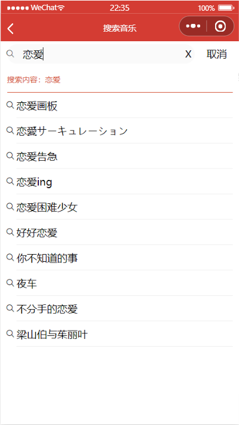

# Music微信小程序云音乐

#### 介绍
基于网易云真实接口的微信小程序音乐播放器

#### 软件架构

- Node.js作为后台服务的接口
- ES语法
- promise对象进行异步网络请求
- moment.js日期时间格式化
- pubsub.js消息的发布和订阅，进行不页面间的数据传递

#### 安装教程

1. 下载解压或克隆项目

2. 进入music_server 目录，在地址栏输入cmd，进入控制台

   

   

   

3. 控制台输入`npm start`启动服务，可能会提示`nodemon`不是内外部程序，则通过`npm install -g nodemon`解决

   

   

4. 微信开发者工具打开musicPlayer，并进行如下设置，之后就可以编译运行了

   

#### 项目截图

1. 主页

   

2. 每日推荐页面

   

3. 音乐播放及歌词显示页面

   

4. 视频页

   

   

5. 搜索页

   

   

6.  个人页面

   

7.  登录页面

   

8.  登录后页面

   

   

